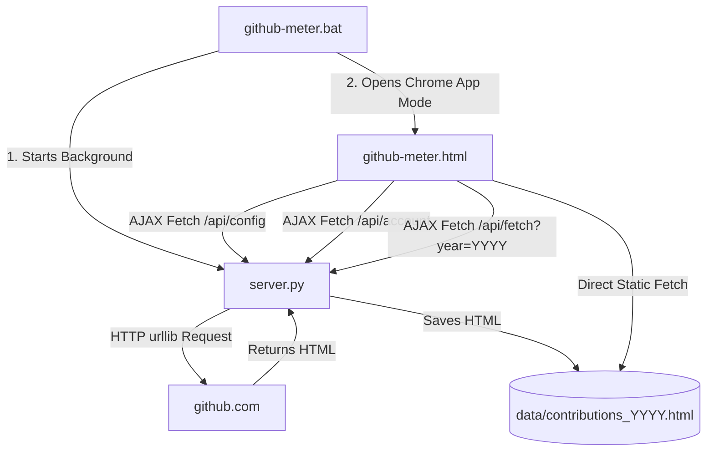

# Code Documentation - GitHub Contribution Meter

This document outlines the codebase functionality, architecture, and module interaction of the GitHub Contribution Meter.

## Architecture Overview

---

## 1. Scraper Module (`fetch_contributions.py`)
Responsible for fetching the raw HTML of a user's GitHub contribution graph for a given year via HTTP. Uses Python's built-in `urllib` — no Selenium or browser automation required.

- **`fetch_contributions(year)`**:
  - Loads `GITHUB_PROFILE` from `.env` via `python-dotenv`.
  - Extracts the username from the profile URL.
  - Constructs the contributions URL: `https://github.com/users/<username>/contributions?tab=overview&from=<year>-01-01&to=<year>-12-31`.
  - Performs an HTTP GET request with a browser-like `User-Agent` header and a 30-second timeout.
  - Validates the response: checks for minimum length, presence of `ContributionCalendar-day` cells, and `data-date` attributes.
  - Saves valid HTML to `data/contributions_<year>.html`.
  - Retries up to 3 attempts with exponential backoff (1s, 2s, 4s).
  - Cleans up old cached files, keeping only the 6 most recent.
  - Raises `RuntimeError` immediately on 404 (profile not found).

---

## 2. Server Module (`server.py`)
A lightweight backend utilizing Python's built-in `http.server.ThreadingHTTPServer` (thread-safe).

- **Configuration**:
  - Port: `8090`
  - Loads `.env` once at startup for `GITHUB_PROFILE`.
  - Extracts username from the profile URL for API calls.
- **API Endpoints**:
  - `/api/config` (GET): Returns the profile URL and parsed username. Cached for 5 minutes.
  - `/api/account` (GET): Fetches account creation date from the GitHub API (`GET /users/<username>`). Uses ETag/Last-Modified conditional requests and a 1-hour cache with 5-minute cooldown on failures.
  - `/api/fetch?year=YYYY` (GET): Validates the year parameter (must be 4-digit, between 2015 and current year), then invokes `fetch_contributions(year)`. Returns JSON status. Thread-safe via a mutex lock — concurrent fetch requests return 429.
- **Static File Serving**: Serves frontend assets (`github-meter.html`, `data/contributions_*.html`). Includes custom CORS and security headers (`X-Content-Type-Options`, `Referrer-Policy`).

---

## 3. Frontend Module (`github-meter.html`)
The client UI styled with Inter and JetBrains Mono fonts.

- **Theme Engine**: Handles CSS class binding to apply color palettes (Dracula, Classic Green, Obsidian, Halloween, Violet, Cyberpunk, Arctic, Sakura, Paper) to grid day blocks and legend nodes.
- **Tooltip Handler**: Captures mouse movements over `.ContributionCalendar-day` blocks and maps the hover cell's `id` to the matching `<tool-tip for="...">` description to show floating details.
- **AJAX Fetch Flow**:
  - On load, checks if `data/contributions_YYYY.html` exists locally; if not, triggers `/api/fetch?year=YYYY`.
  - When the user clicks **Refresh**, sends a request to `/api/fetch?year=YYYY`.
  - Once fetching completes, fetches the saved `data/contributions_YYYY.html`.
  - Parses the raw HTML by creating a temporary `div` element and setting its `innerHTML`, extracts the contribution calendar grid, and appends it to the DOM.
- **Zero-State UI**: Displays one of 5 playful messages when no contribution data is available.
- **Year Navigation**: Year cycler (◀/▶) with ascending order (2015 to current year), persisted in localStorage.
- **Theme Persistence**: Selected theme is saved in localStorage and restored on load.
