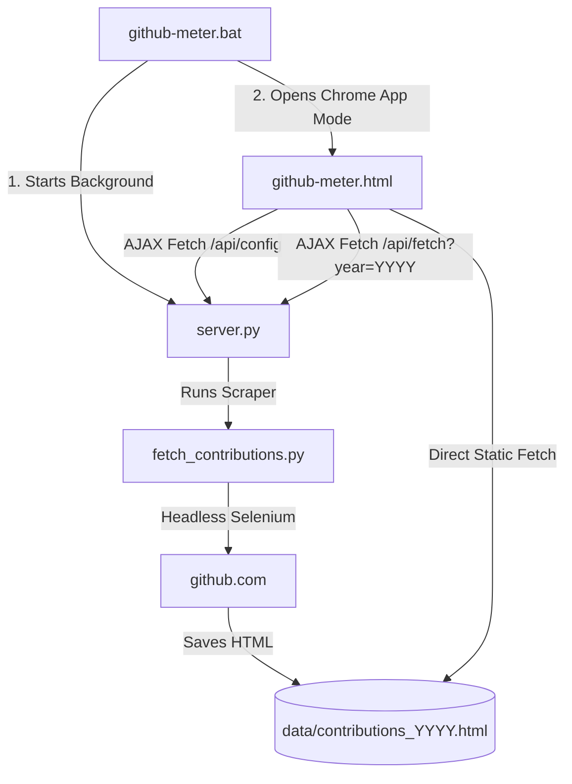

# Code Documentation - GitHub Contribution Meter

This document outlines the codebase functionality, architecture, and module interaction of the GitHub Contribution Meter.

## Architecture Overview

---

## 1. Scraper Module (`fetch_contributions.py`)
Responsible for headlessly fetching the raw HTML of a user's GitHub contribution graph for a given year.

- **`fetch_contributions(year)`**:
  - Initializes Selenium `webdriver.Chrome` in headless mode (`--headless=new`).
  - Constructs profile URL target: `https://github.com/<username>?tab=overview&from=<year>-01-01&to=<year>-12-31`.
  - Blocks loading images to minimize network latency.
  - Wait conditions: Uses `WebDriverWait` to block until `.ContributionCalendar-day` squares render dynamically (avoiding AJAX blank state capture).
  - Selects the `.js-yearly-contributions` container element.
  - Creates the `data/` folder if missing and saves the file as `data/contributions_<year>.html`.

---

## 2. Server Module (`server.py`)
A lightweight backend utilizing Python's built-in `http.server.HTTPServer`.

- **API Endpoints**:
  - `/api/config` (GET): Reloads `.env` dynamically and returns the profile URL and parsed username.
  - `/api/fetch` (GET): Reads `?year=YYYY` query parameter and invokes `fetch_contributions(year)`. Returns a JSON status response.
- **Static File Serving**: Serves frontend assets (`github-meter.html`, `data/contributions_*.html`). Includes custom CORS headers.

---

## 3. Frontend Module (`github-meter.html`)
The client UI styled with Inter and JetBrains Mono fonts.

- **Theme Engine**: Handles CSS class binding to apply color palettes (Dracula, Obsidian, Standard, Halloween, Violet) to grid day blocks and legend nodes.
- **Tooltip Handler**: Captures mouse movements over `.ContributionCalendar-day` blocks and maps the hover cell's `id` to the matching `<tool-tip for="...">` description to show floating details.
- **AJAX Fetch Flow**:
  - When loading or clicking **Refresh**, it sends a request to `/api/fetch?year=YYYY`.
  - Once scraping completes, it fetches `data/contributions_YYYY.html`.
  - Parses the raw text by creating a temporary `div` element and setting its `innerHTML`, extracts `table.ContributionCalendar-grid`'s parent element, and appends it to keep only the clean grid layout.
